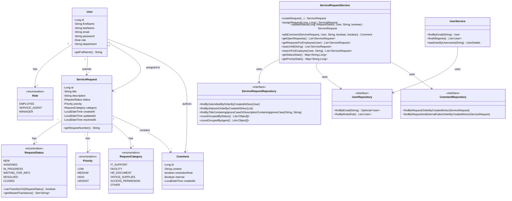
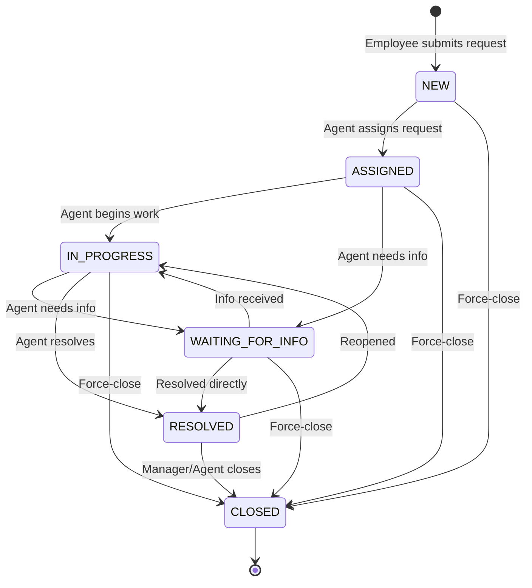

# OOAD Document — Enterprise Service Request Management System

## 1. Object-Oriented Analysis

### Problem Statement
Employees at a medium-sized company manage internal service requests through email, phone calls, and spreadsheets. This leads to lost requests, unclear responsibilities, no status transparency, and no management visibility. The system replaces this with a centralised, role-aware request tracking application.

### Key Domain Concepts
- A **User** belongs to exactly one **Role** (EMPLOYEE, SERVICE_AGENT, MANAGER).
- An **Employee** submits **ServiceRequests** which they can view and track.
- A **Service Agent** picks up open requests, updates their status, and communicates via **Comments**.
- A **Manager** has access across all requests and uses dashboard statistics to monitor workload and resolution rates.
- Each **ServiceRequest** has a **Priority**, a **RequestCategory**, and a **RequestStatus** that advances through a defined lifecycle.
- **Comments** belong to a request and carry an author, a timestamp, and optional flags (`resolutionNote`, `internal`).

---

## 2. Class Diagram

---

## 3. Request Lifecycle (State Machine)

The `canTransitionTo()` method on `RequestStatus` encodes this graph. Closing from any non-closed status is always allowed; `CLOSED` is a terminal state.

---

## 4. Key Design Decisions

### 4.1 Transition logic belongs to `RequestStatus`
The status enum itself owns the transition graph (`Set<String> allowedTransitions`) and exposes `canTransitionTo(RequestStatus)`. This follows the **Information Expert** principle — the entity that knows the rules enforces them. `ServiceRequestService` calls `validateTransition()` before persisting, but does not duplicate the graph.

### 4.2 Layered architecture (Controller → Service → Repository)
Controllers are thin: they extract HTTP parameters and delegate to services. Services own all business logic and validation. Repositories handle only queries. This keeps each layer testable in isolation — service tests mock the repositories; no Spring context is needed.

### 4.3 `UserService implements UserDetailsService`
Spring Security's authentication pipeline requires a `UserDetailsService`. By implementing it directly on `UserService`, the domain `User` model doubles as the security principal without a separate DTO/adapter layer. This reduces indirection at the cost of a small coupling to Spring Security.

### 4.4 Enums for `Priority`, `RequestCategory`, `RequestStatus`
Each enum carries its own `displayName` metadata and, in the case of `RequestStatus`, behavioural logic. Stored as `EnumType.STRING` in the database so values are human-readable and schema changes don't require data migration. Invalid values are compile errors, not runtime bugs.

### 4.5 `Comment.internal` flag
Comments can be marked internal (visible to agents/managers only) or public (visible to all parties). This avoids a separate entity hierarchy for different comment types while still supporting the operational need for agent-only notes.

### 4.6 H2 file-based persistence
A file-backed H2 database (`ddl-auto=update`) was chosen to keep the prototype self-contained with no external infrastructure dependency, while still providing real persistence across restarts. Switching to PostgreSQL would require only a change to `application.properties` and the Maven dependency.

---

## 5. Responsibilities Summary

| Class | Responsibility |
|---|---|
| `User` | Domain entity; authentication principal |
| `ServiceRequest` | Core aggregate; owns lifecycle state |
| `Comment` | Audit trail and communication thread on a request |
| `RequestStatus` | Encodes the state machine and valid transitions |
| `ServiceRequestService` | All business logic: create, assign, transition, comment, search |
| `UserService` | User lookup; Spring Security integration |
| `*Repository` | Data access only — no business logic |
| `*Controller` | HTTP mapping; delegates immediately to services |
| `SecurityConfig` | URL-level access rules per role |
| `DataInitializer` | Seeds demo users and sample requests on first startup |
